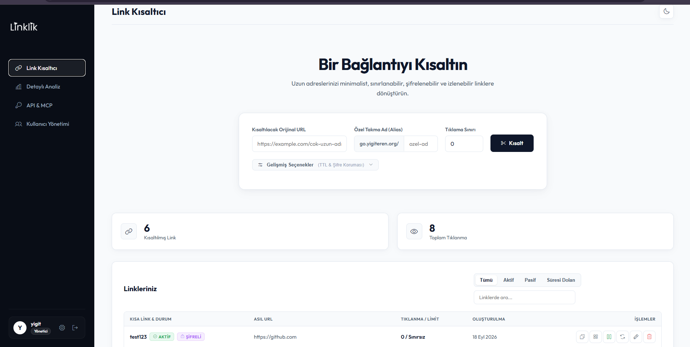

<p align="center">
  
</p>

<h1 align="center">🔗 Linklik — Hafif, Yüksek Performanslı, MCP Destekli ve API-First Link Kısaltma Servisi</h1>

<p align="center">
  Go & SQLite ile geliştirilmiş, minimal bağımlılığa sahip, üretim için tasarlanmış açık kaynaklı modern URL kısaltma servisi.
</p>

---

## 📖 Nedir?

**Linklik**, Go (Golang) ve SQLite kullanılarak geliştirilmiş, sıfır CGO bağımlılığına sahip, yüksek performanslı ve modern tasarımlı açık kaynaklı bir URL kısaltma ve analiz servisidir.

Proje, hem kullanıcı dostu bir yönetim paneline sahip olması hem de AI ajanlarının (Claude Desktop, Cursor, Goose vb.) ve harici otomasyonların saniyeler içinde entegre olabilmesi için **API-First** ve yerel **Model Context Protocol (MCP)** standartlarıyla tasarlanmıştır.

## 🚀 Öne Çıkan Özellikler

- **Go & Chi Router** — Hızlı, ölçeklenebilir ve standart kütüphaneye yakın modern web mimarisi.
- **Model Context Protocol (MCP) Entegrasyonu** — Claude Desktop ve Cursor gibi AI ajanlarının doğrudan link kısaltmasını, analitik okumasını ve link yönetmesini sağlayan yerel SSE ve stdio MCP sunucusu.
- **WAL Modu SQLite & Otomatik Göçler** — CGO gerektirmeyen pure-Go SQLite sürücüsü, Write-Ahead Logging (WAL) ve canlı güncellemelerde veri kaybını önleyen versiyonlu göç motoru (`schema_migrations`).
- **Gelişmiş Link Özellikleri**:
  - **Son Kullanma Tarihi (TTL)**: Belirli bir tarihten sonra otomatik devre dışı kalan linkler.
  - **Şifre Korumalı Linkler**: Ziyaretçiden parola isteyen güvenli yönlendirme.
  - **Aktif / Pasif Anahtarı**: Linki silmeden tek tıkla geçici olarak durdurma ve açma.
  - **İstatistik Sıfırlama**: Linkin tıklama ve analitik verilerini sıfırlayabilme.
  - **Dinamik QR Kod Üretimi**: Panelden ve API'den PNG formatında yüksek çözünürlüklü QR kod çıktısı.
  - **UTM Parametre Koruma**: Gelen UTM ve arama parametrelerinin hedef adrese eksiksiz aktarılması.
  - **Sayfalama & Arama**: Binlerce link arasında anında arama ve durum filtresi (`Tümü`, `Aktif`, `Pasif`, `Süresi Dolan`).
- **Asenkron Worker Havuzu & IP Önbelleği** — 4 worker'lı arabellekli kuyruk (buffered channel) ve thread-safe in-memory GeoIP önbelleği sayesinde sıfır gecikme ve yüksek RPS dayanıklılığı.
- **Ters Proxy & Docker Uyumu** — Cloudflare (`CF-Connecting-IP`), Nginx/Caddy (`X-Forwarded-For`) arkasında gerçek istemci IP tespiti ve CIDR güvenlik filtrelemesi.
- **Konteyner Sağlık Uç Noktaları** — Docker ve Kubernetes için `/healthz` (liveness) ve `/readyz` (readiness) kontrolleri.
- **İlk Kurulum (Setup) Akışı** — Sistemde hiç kullanıcı bulunmadığında `/setup` sayfası üzerinden kaydolan ilk kişi otomatik **Superadmin** olur ve ardından bu rota kalıcı olarak kapatılır.
- **Premium Karanlık Temalı Arayüz** — Modern Glassmorphism efektleri, Bento Grid düzeni ve Chart.js çizgi grafik entegrasyonu.

## 💾 Donanım ve Kaynak Tüketim Raporu

| Metrik | Değer |
| --- | --- |
| **RAM (Boşta)** | 10 – 15 MB |
| **RAM (Yoğun Yük)** | 30 – 50 MB |
| **Binary Boyutu** | ~15 MB |
| **Disk / 10K link + 100K tıklama** | ~20 – 25 MB |
| **Throughput (1 vCPU / 1 GB VPS)** | 10.000+ RPS |

---

## 🤖 Model Context Protocol (MCP) AI Ajan Entegrasyonu

Linklik, AI ajanlarının araç çağrıları (Tool Calling) ile servisle konuşabilmesi için **Model Context Protocol (MCP)** standartlarını destekler.

### 1. Cursor Entegrasyonu (`.cursor/mcp.json`)

```json
{
  "mcpServers": {
    "linklik": {
      "url": "http://localhost:8080/mcp/sse",
      "headers": {
        "X-API-KEY": "lk_your_api_key_here"
      }
    }
  }
}
```

### 2. Claude Desktop Entegrasyonu (`claude_desktop_config.json`)

```json
{
  "mcpServers": {
    "linklik": {
      "command": "linklik",
      "args": ["--mcp", "--api-key", "lk_your_api_key_here"]
    }
  }
}
```

### Sunulan MCP Araçları (Tools):
- `shorten_link`: Yeni link kısaltma, özel alias, limit, son kullanma tarihi ve aktiflik belirleme.
- `list_links`: Linkleri arama ve sayfalama ile listeleme.
- `get_link_analytics`: Detaylı tıklanma, coğrafi dağılım ve tarayıcı istatistiklerini alma.
- `toggle_link`: Linki anında durdurma veya aktifleştirme.
- `reset_link_stats`: Tıklama sayısını ve analitik geçmişini sıfırlama.
- `delete_link`: Kısaltılmış linki silme.

---

## 💻 REST API Kullanımı

Her kullanıcının panelden görüntüleyebileceği bir `X-API-KEY` değeri bulunur.

### 1. Link Kısaltma (Gelişmiş)
- **Rota:** `POST /api/v1/links`
- **İstek Başlığı:** `X-API-KEY: lk_your_api_key`
- **İstek Gövdesi:**
```json
{
  "url": "https://deepmind.google/technologies/gemini/",
  "custom_alias": "gemini-model",
  "max_clicks": 500,
  "expires_at": "2026-12-31T23:59:00Z",
  "password": "istege_bagli_sifre",
  "is_active": true
}
```

### 2. Dinamik QR Kod Alma
- **Rota:** `GET /api/v1/links/{short_code}/qr?size=300`
- **Çıktı:** Doğrudan indirilebilir ve önbelleklenebilir PNG QR görseli.

### 3. Aktif/Pasif Durumunu Değiştirme
- **Rota:** `PATCH /api/v1/links/{short_code}/toggle`
- **İstek Başlığı:** `X-API-KEY: lk_your_api_key`

### 4. İstatistikleri Sıfırlama
- **Rota:** `POST /api/v1/links/{short_code}/reset-stats`
- **İstek Başlığı:** `X-API-KEY: lk_your_api_key`

### 5. Linkleri Listeleme (Sayfalama & Arama)
- **Rota:** `GET /api/v1/links?page=1&limit=20&search=gemini&status=active`
- **İstek Başlığı:** `X-API-KEY: lk_your_api_key`

---

## ⚡ Canlıya Kesintisiz Dağıtım (Zero-Downtime Safe Deploy)

Projeyi üretim sunucunuza aktarırken veya yeni sürümleri güncellerken:
1. **Veritabanı Göçleri:** Sunucu her başladığında `schema_migrations` kontrolü yapar. Veritabanınızı manuel silmenize veya kolon eklemenize gerek kalmaz; tüm güncellemeler geriye dönük uyumludur.
2. **Konteyner Sağlık Kontrolü:** `/healthz` ve `/readyz` uç noktaları Docker/Kubernetes tarafından izlenir.
3. **Graceful Shutdown:** Dağıtım anında `SIGTERM` sinyali geldiğinde iş kuyruğundaki tıklamalar veritabanına yazılana kadar beklenir ve hiçbir veri kaybolmaz.

### Docker Compose ile Başlatma

```bash
docker compose up -d --build
```

---

## 📄 Lisans

Bu proje açık kaynaklı olup, **MIT Lisansı** altında dağıtılmaktadır.
